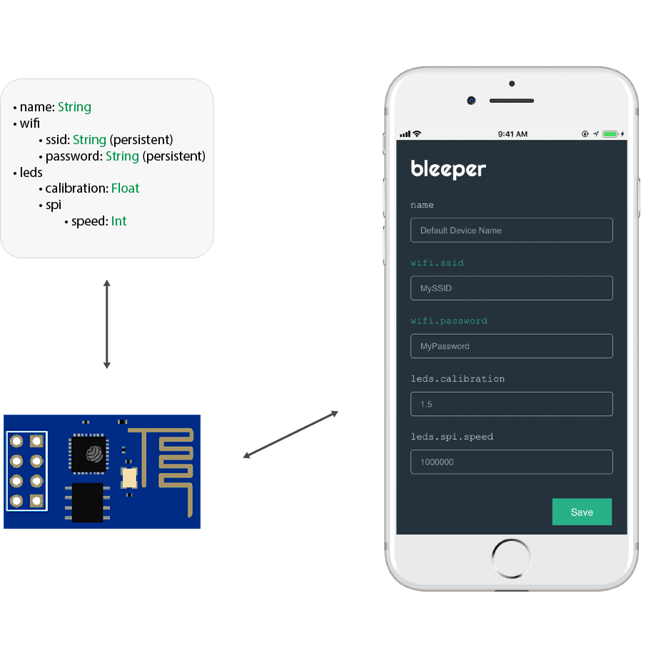
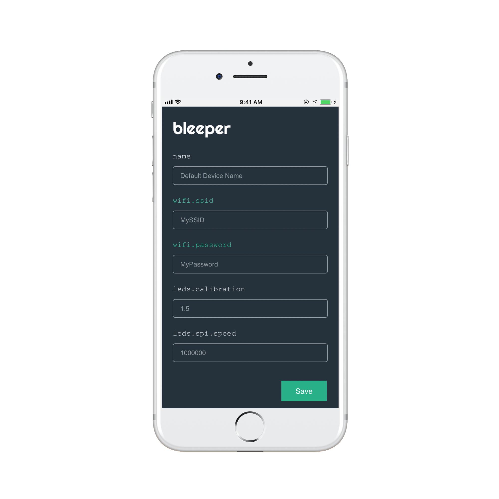

<p align="center">

</p>

Bleeper is a library to manage your firmware configurations written in C++ for [ESP8266](https://github.com/esp8266/Arduino) and [ESP32](https://github.com/espressif/arduino-esp32) Arduino Platforms.

- [Features](#features)
- [Why Bleeper](#why-bleeper)
- [Usage](#usage)
- [Installation](#installation)
  - [Arduino IDE](#arduino-ide)
  - [PlatformIO IDE for Atom](#platformio-ide)
- [Future Work](#future-work)

## Features

- [x] Fully customizable hierarchical configuration structure
- [x] Generic property types
- [x] Automatic storage with property granularity (EEPROM & SPIFFS)
- [x] Wifi & AP connections
- [x] Configuration interfaces (web panel by default)
- [x] Observe any configuration property change through the observer API

## Why Bleeper

In the scenario of prototyping with hardware devices you will likely end up with a bunch of configuration settings like pin numbers, sensor thresholds, device ids, connection credentials, port numbers, and so many others.  
As a good programmer you decide to define these configurations in a "configuration file" with a lot of `#define` macros or constants.  

But... what if you want to change those values? Downloading the firmware each time is tedious. Think about the cases where you have multiple devices to configure or even worst you don't have close physical access to them.

At the end you realize that you actually need some sort of "Configuration Manager" with high level features like exposing those variables on a web panel (or another type of interface), persisting some of them (usually your Wifi credentials) and so on.

## Usage

Suppose that you have this configuration:

<p align="center">

</p>
<!--  -->
<!--  -->
<!--  -->
<!--  -->


The above tree structure speaks by its own, what's worth to mention here is that we want `wifi.ssid` and `wifi.password` to be persistent using the Bleeper storage.

The C++ code will look like this:

```cpp
#include "Bleeper.h"

class Config: public RootConfiguration {
public:
  stringVar(name, "Default Device Name");
  subconfig(WifiConfig, wifi);
  subconfig(LedsConfig, leds);
};

class WifiConfig: public Configuration {
public:
  persistentStringVar(ssid, "MySSID");
  persistentStringVar(password, "MyPassword");
};

class LedsConfig: public Configuration {
public:
  floatVar(calibration, 1.5);
  subconfig(SPIConfig, spi);
};

class SPIConfig: public Configuration {
public:
  intVar(speed, 1000000);
};
```

Basically, per each configuration node you have to implement a subclass of `Configuration` and a `RootConfiguration` subclass for the especial root node (i.e the top level entry).  

> For a full documentation on how properties are defined read [here](docs/VARIABLES.md).

Once we completed our configuration structure we can use it like this:

```cpp
// Your Config instance
Config C;

void loop() {
  // access to your spi speed config
  int speed = C.leds.spi.speed
}

```

> Note that all variables are type-safe. You are not accessing to a generic wrapper and casting its type.

The final step is to setup the Bleeper singleton instance with your `RootConfiguration` instance and specify your connections, interfaces, storage and observers.

```cpp
#include "Bleeper.h"

class CalibrationObserver: public ConfigurationObserver {
public:
  void onConfigurationChanged(const ConfigurationPropertyChange value) {
    Serial.println("Configuration " + value.key + " changed from " + value.oldValue + " to " + value.newValue);
  }
};

Config C;

void setup() {

  Bleeper
    .verbose(115200)
    .configuration
      .set(&C)
      .addObserver(new CalibrationObserver(), {&C.leds.calibration})
      .done()
    .configurationInterface
      .addDefaultWebServer()
      .done()
    .connection
      .setSingleConnectionFromPriorityList({
          new Wifi(&C.wifi.ssid, &C.wifi.password),
          new AP() // fallback
      })
      .done()
    .storage
      .setDefault() // EEPROM
      // .set(new SPIFFSStorage()) // SPIFFS
      .done()
    .init();
}

void loop() {

  Bleeper.handle();

}
```

Basically Bleeper exposes four entry points:

1. **Bleeper.configuration**  

  Lets you set your `RootConfiguration` instance and add observers to changes on it. In this example we are setting the `CalibrationObserver` instance that will be only notified about changes on the `C.leds.calibration` property.

2. **Bleeper.configurationInterface**  

  Here you can add as many `ConfigurationInterface` instances as you want. Bleeper provides a default web panel when calling `addDefaultWebServer`.

2. **Bleeper.connection**  

  Under connection we can call `setMultipleConnections` or `setSingleConnectionFromPriorityList` (in which only one connection will be active) and provide a list of `Connection` instances. By default the `Wifi` class will observe changes on the provided credentials and retry the connection accordingly.  

2. **Bleeper.storage**  

  Lets you specify the `Storage` instance to use when saving your persistent variables. Calling `setDefault` will use the default EEPROM storage automatically. You can also use `SPIFFSStorage` or create your own instead.

## Installation

### Arduino IDE

Go to Sketch > Include Library > Manage Libraries...  
Search for `Bleeper` and click on `Install`

### PlatformIO IDE

Go to your `platformio.ini` file and add the following lines:
```
lib_deps = Bleeper
lib_ldf_mode = deep
```

## Future Work

- Add support for other boards.
- Improve documentation & examples.
- Add CI server & tests.

## Author

* [Diego Ernst](https://github.com/dernster)
